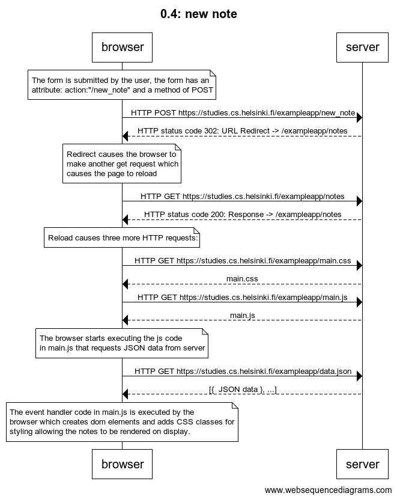

# 0.4: new note

```
Title: 0.4: new note

note over browser:
The form is submitted by the user, the form has an 
attribute: action:"/new_note" and a method of POST 
end note

browser->server: HTTP POST https://studies.cs.helsinki.fi/exampleapp/new_note
server-->browser: HTTP status code 302: URL Redirect -> /exampleapp/notes 

note over browser:
Redirect causes the browser to 
make another get request which 
causes the page to reload
end note

browser->server: HTTP GET https://studies.cs.helsinki.fi/exampleapp/notes
server-->browser: HTTP status code 200: Response -> /exampleapp/notes

note over browser:
Reload causes three more HTTP requests:
end note

browser->server: HTTP GET https://studies.cs.helsinki.fi/exampleapp/main.css
server-->browser: main.css

browser->server: HTTP GET https://studies.cs.helsinki.fi/exampleapp/main.js
server-->browser: main.js

note over browser:
The browser starts executing the js code in 
main.js that requests JSON data from server 
end note

browser->server: HTTP GET https://studies.cs.helsinki.fi/exampleapp/data.json
server-->browser: [{  JSON data }, ...]

note over browser:
The event handler code in main.js is executed by the 
browser which creates dom elements and adds CSS classes 
for styling allowing the notes to be rendered on display.
end note

```
