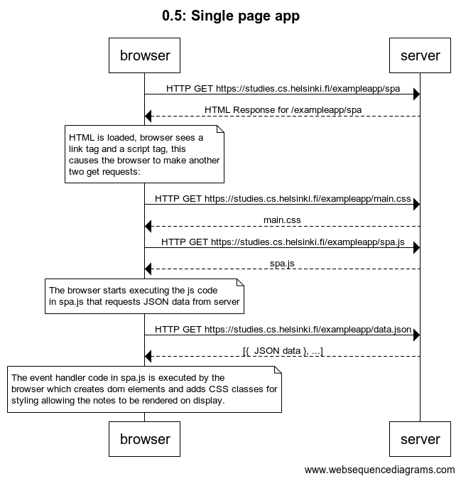

# 0.5: Single page app

```
Title 0.5: Single page app
    
browser->server: HTTP GET https://studies.cs.helsinki.fi/exampleapp/spa
server-->browser: HTML Response for /exampleapp/spa

note over browser:
HTML is loaded, browser sees a link tag 
and a script tag, this causes the browser 
to make another two get requests: 
end note

browser->server: HTTP GET https://studies.cs.helsinki.fi/exampleapp/main.css
server-->browser: main.css
browser->server: HTTP GET https://studies.cs.helsinki.fi/exampleapp/spa.js
server-->browser: spa.js

note over browser:
The browser starts executing the js code 
in spa.js that requests JSON data from server 
end note

browser->server: HTTP GET https://studies.cs.helsinki.fi/exampleapp/data.json
server-->browser: [{  JSON data }, ...]

note over browser:
The event handler code in spa.js is executed by the 
browser which creates dom elements and adds CSS classes for 
styling allowing the notes to be rendered on display.
end note
```
