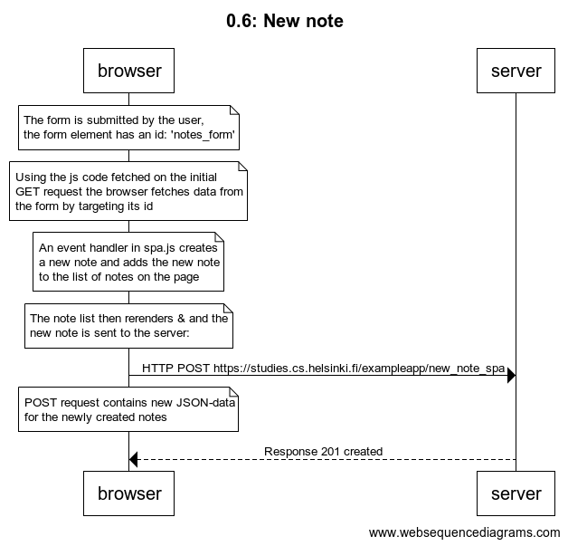

# 0.6: New note

```
title 0.6: New note

note over browser:
The form is submitted by the user, 
the form element has an id: 'notes_form'
end note

note over browser:
Using the js code fetched on the initial 
GET request the browser fetches data from 
the form by targeting its id
end note

note over browser:
An event handler in spa.js creates 
a new note and adds the new note 
to the list of notes on the page
end note

note over browser:
The note list then rerenders & and the 
new note is sent to the server: 
end note

browser->server: HTTP POST https://studies.cs.helsinki.fi/exampleapp/new_note_spa

note over browser:
POST request contains new JSON-data
for the newly created notes
end note
server-->browser: Response 201 created 
```

